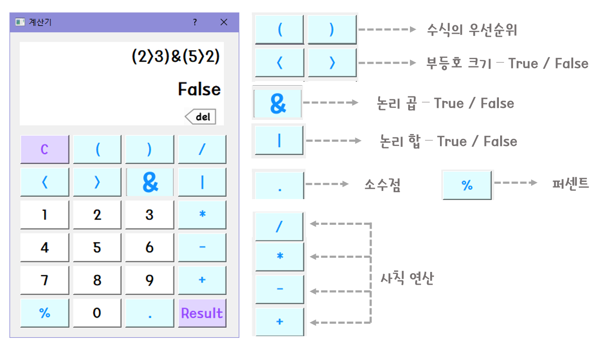

# Floating_Calculator
PyQt5 - 화면 고정 계산기

 
 

## 📑 프로젝트 개요
- 자바로 계산기를 제작하다가 파이썬과 Qt Designer를 이용하여 계산기를 만들 수 있다고 하여 인터넷 자료를 활용하여 계산기를 제작하였습니다. 
- 회로 조작 시 필요한 AND, OR 계산도 반영을 하여 True, False를 반환해주는 기능도 추가하였습니다. 
- 컴퓨터에서 계산기를 사용하다보면 다른 창에 계산기가 가려져서 사용하기 힘들었는데 이번에 제작한 계산기는 그 점을 해결하여 불편한 점을 개선하였습니다. 
 

## 📋 시스템 기능

 

## 💻 프로젝트 구현

### [ 구현 영상 ]

